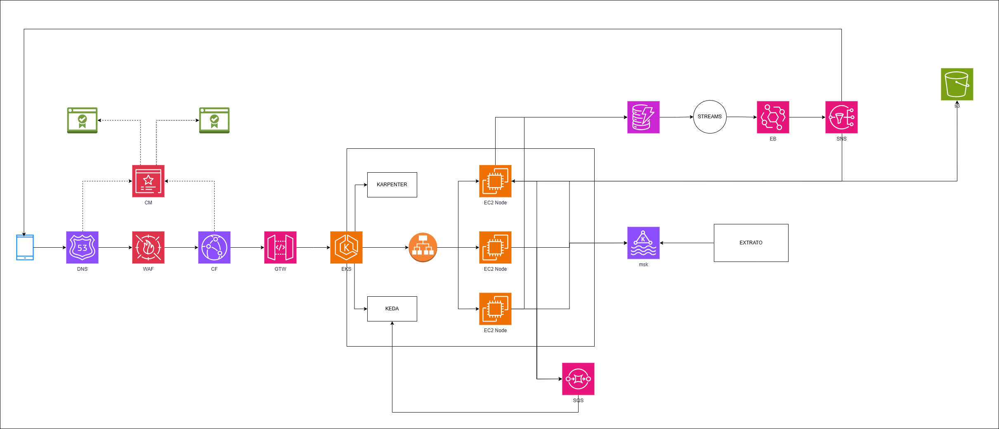

# Desafio Técnico - Vaga Sênior

Este repositório contém a documentação e soluções propostas para o desafio técnico de uma vaga sênior. O processo foi dividido em duas fases:

---

## 🧹 Fase 1: Arquitetura de Solução na AWS

### ✅ Desafio

> Criar um sistema na AWS que realize o **cancelamento de um débito automático** através da chamada via aplicativo do celular (super app).

### 📊 Requisitos e Premissas

* **Volume**: 60 milhões de transações por dia
* **Disponibilidade**: 24/7
* **Tempo de resposta**: até um segundo

### 📌 Funcionalidades obrigatórias

1. Atualizar a situação/status do débito para “Cancelado”
2. Gerar comprovante para o cliente
3. Alterar o extrato para excluir o lançamento futuro do cliente

> ⚠️ Os itens 1 e 2 devem acontecer online. O item 3 pode ser processado posteriormente.

---

### 🖼️ Diagrama de Solução Proposta

---

### 🧬 Explicação da Arquitetura

A seguir, descrevo a arquitetura elaborada para atender o desafio de cancelamento de débito automático em ambiente AWS:

#### 📱 Entrada via Aplicativo Mobile

* A chamada parte de um **aplicativo mobile**, direcionada a uma API exposta na AWS.

#### 🌐 Camada de Entrada e Segurança

* **Route 53 (DNS)**: Utilizado para gerenciamento de DNS, trazendo maior flexibilidade, customização e benefícios frente ao DNS padrão do API Gateway.
* **WAF (Web Application Firewall)**: Proteção contra ameaças como ataques DDoS e inspeção de tráfego HTTP malicioso.
* **CloudFront (CDN)**: Utilizado para distribuir as chamadas do API Gateway com baixa latência e alto desempenho.
* **AWS Certificate Manager (ACM)**: Armazena os certificados SSL usados no Route 53 e no CloudFront, garantindo que toda comunicação ocorra via HTTPS.

#### ⟳ Camada de API

* **API Gateway (REST)**: Interface RESTful para expor a API de cancelamento. A escolha por REST é pela simplicidade e compatibilidade com a estrutura proposta.

#### ☘️ Camada de Processamento

* **EKS (Elastic Kubernetes Service)**: Os microserviços rodam em um cluster Kubernetes gerenciado.
* **Ingress + ALB**: Utilizados para controle de entrada no cluster e roteamento interno entre serviços.
* **Autoescalabilidade**:

  * **KEDA (Kubernetes Event-Driven Autoscaling)**: Escala os pods dinamicamente com base na fila SQS. Assim, o sistema responde automaticamente ao volume de requisições.
  * **Karpenter**: Escala automaticamente os nodes do cluster EKS conforme os recursos necessários são solicitados pelos pods em execução.

#### 📨 Comunicação Assíncrona

* Os microserviços, após processarem as requisições de cancelamento, publicam mensagens em uma fila **SQS**, permitindo que os eventos sejam tratados de forma desacoplada e escalável.
* O **KEDA** monitora essa fila SQS para determinar a necessidade de escalar a aplicação.

#### 📙 Organização por Domínio (DDD - Domain Driven Design)

* A arquitetura foi desenhada com base em **DDD**, separando claramente os domínios de responsabilidade.

##### 🔄 Domínio de Débito (Funcional)

* Responsável pelo **processamento do cancelamento** do débito automático.
* Garante que a operação de cancelamento seja completada com consistência.
* Toda a transação e persistência de status é gerenciada por um **DynamoDB**, com registros atualizados em tempo real.

##### 📤 Comunicação com Domínio de Extrato

* O domínio de débito **emite eventos** para o domínio de extrato via:

  * **Kafka (MSK)** ou uma estrutura de mensageria de **event streaming**, garantindo comunicação assíncrona e desacoplada.
* O domínio de extrato então consome esses eventos e realiza o processamento necessário (fora da responsabilidade do domínio de débito).

#### 📚 Atualização de Extrato e Geração de Comprovante

* O status do cancelamento é armazenado no **DynamoDB**.
* Quando esse status é atualizado para “Finalizado”, o **DynamoDB Streams** entra em ação:

  * O stream é conectado a um **EventBridge**, que roteia o evento para um **SNS**.
  * O **SNS** publica uma notificação para o cliente, informando que o cancelamento foi concluído com sucesso.

##### 📂 Geração do Comprovante (PDF)

* Um microserviço dedicado gera o **comprovante em PDF** utilizando **JasperReports** (Java).
* O arquivo PDF gerado é armazenado com segurança em um **bucket S3**.
* Esse processo é ativado com base na alteração de status capturada no **DynamoDB Stream**.

---

## 🧪 Fase 2: Desafio de Codificação

### 🎯 Desafio

Desenvolver uma aplicação que:

* Receba chamadas de um **API Gateway** para **cancelar um débito**
* Retorne uma mensagem **"OK"** para o cliente
* Publique uma **mensagem/evento em um tópico SQS**

---

### ⚙️ Requisitos Técnicos

* Linguagem: **Java 21**
* Arquitetura: **Hexagonal (Ports & Adapters)**
* Infraestrutura como código: **Terraform**

---

### 📁 Repositórios

Os repositórios contendo os códigos e detalhes da solução proposta estão disponíveis abaixo:

- [🔗 Repositório microserviço Java](https://github.com/itau-daily-banking/ms-cancelamento-debito)
- [🔗 Repositório Terraform SQS](https://github.com/itau-daily-banking/infra-sqs)
- [🔗 Repositório Terraform API Gateway](https://github.com/itau-daily-banking/infra-api-gateway)
- [🔗 Repositório Terraform EKS](https://github.com/itau-daily-banking/infra-eks)

